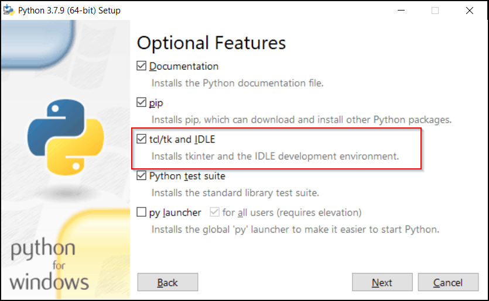

# What this tool is
When doing a calibration on some Creality 3D printers, how far the printer is adjusting is shown on a screen titled "Auto Leveling".
It can be hard to visualise what these numbers mean and so this tool allows you to see what those numbers look like.

# Requirements
- Python 3
- matplotlib
- tkinter

All requirements are in the virtual environment which was made on a Linux machine

# Usage
## Linux/POSIX
To run this program, run the following commands.
```
git clone https://github.com/OldYoshi5258/Creality_printer_bed_heightmap_viewer.git
cd Creality_printer_bed_heightmap_viewer
chmod +x setup.bash
./setup.bash
```
You should have tkinter installed which has the package name of `python3-tk` on most distributions e.g. `sudo apt install python3-tk`.

## Windows
1. Download a ZIP of the main branch [here](https://github.com/OldYoshi5258/Creality_printer_bed_heightmap_viewer/archive/refs/heads/main.zip)
2. Make sure you have python installed with tkinter. When installing python, make sure this box is ticked

3. Run `pip install matplotlib` in powershell or the command prompt
4. Open `main.py` with the python interpreter